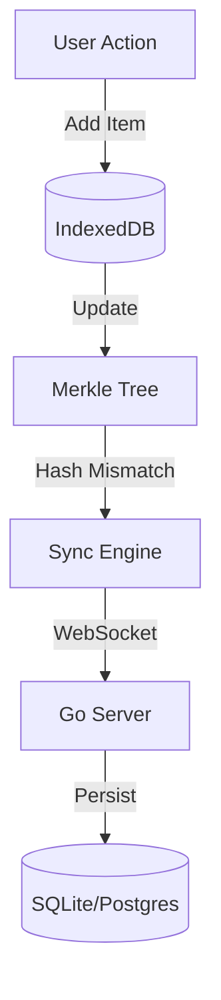

# GoSync


**A relentless, offline-first sync engine for Go.**  
*Zero dependencies. Instant sync. Full ownership.*

---

## 🚀 Why GoSync?

Most "offline-first" solutions lock you into their ecosystem (Firebase, Supabase, CouchDB). **GoSync** works differently.

It is a **Protocol**, not a Platform.

- **Go + WASM**: We run the *exact same Go code* in the browser (via WebAssembly) and on the server.
- **IndexedDB Persistence**: Your app works perfectly offline. Data survives refreshes and restarts.
- **Bidirectional Sync**: Changes made offline automatically upload when online. Server changes download instantly.
- **Merkle Tree & Snapshots**: Efficiently detects data mismatches and "heals" the state using a robust sync protocol.
- **Local-First**: The client is the source of truth. The server is just a backup.

## 🛠 Tech Stack

- **Client**: Go (compiled to stored WASM) + IndexedDB (via `idb-keyval`).
- **Server**: Go + SQLite (or switch to Postgres easily).
- **Communication**: WebSockets (Real-time).
- **Storage**: `syscall/js` Bridge to Browser APIs.

## 📦 Installation
```bash
# Install the Client SDK directly from GitHub
npm install github:HarshalPatel1972/GoSync#main --workspace=sdk/js
```

## 🎮 Try it instantly
We included a "Kitchen Sink" demo.

**Windows:**
```cmd
.\run_demo.bat
```

**Mac/Linux:**
```bash
chmod +x run_demo.sh
./run_demo.sh
```

### 🧪 How to Verify (The Magic Trick)
1.  Open `http://localhost:3000`. Status should be **🟢 Online**.
2.  Add a task: "Hello World".
3.  **Kill the Server** (Close the terminal). Status turns **🔴 Offline**.
4.  Add a task: "I am offline".
5.  **Refresh the Page**. The tasks are still there! (IndexedDB Persistence).
6.  **Restart the Server**. Status turns **🟢 Online**.
7.  Check Server Logs: It will say "Synced!" and have both items.

## ⚡ Quick Start

### 1. Build the Server
```bash
# Windows
go build -o server.exe ./cmd/server

# Mac/Linux
go build -o server ./cmd/server
```

### 2. Build the Client (WASM)
```powershell
# Windows (PowerShell)
$env:GOOS = "js"; $env:GOARCH = "wasm"; go build -o dist/main.wasm ./cmd/client
```

```bash
# Mac/Linux
GOOS=js GOARCH=wasm go build -o dist/main.wasm ./cmd/client
```

### 3. Run Everything
Start the Backend:
```bash
./server.exe
```

Start the Frontend Host:
```bash
python -m http.server 3000 --directory dist
```

Visit `http://localhost:3000`. 
Add items. 
Go offline. 
Refresh. 
Synced.

## 💻 Usage Example

How to use GoSync in your own Go application:

```go
// 1. Define your data
type Task struct {
    ID      string
    Content string
}

// 2. Initialize the Sync Engine
repo := gosync.NewBrowserRepo() // Auto-connects to IndexedDB
engine := gosync.NewEngine(repo)

// 3. Add Data (Works Offline!)
engine.Add(Task{ID: "1", Content: "Buy Milk"})
// -> Automatically syncs to server when online
```

## 🏗 Architecture



## 📜 License

MIT License © 2025 Harshal Patel.
